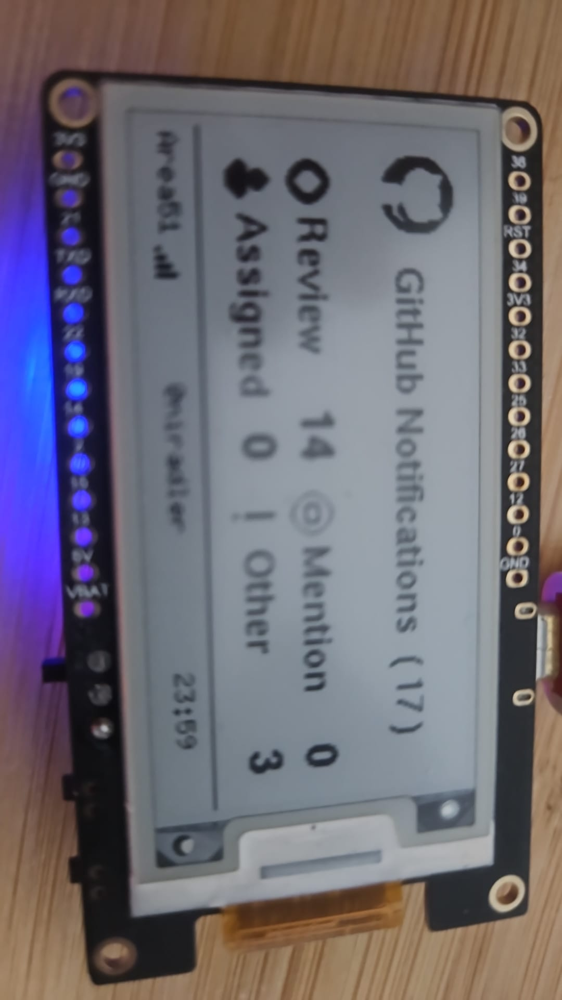
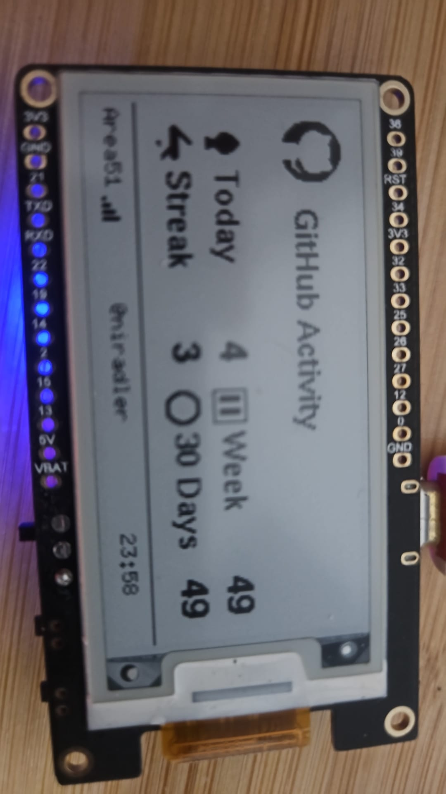
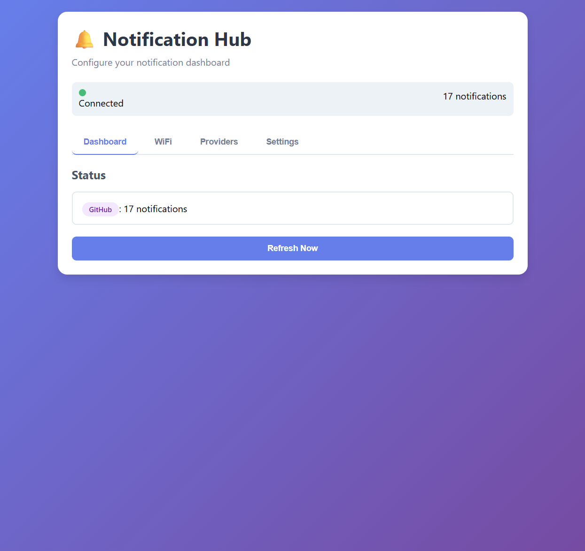
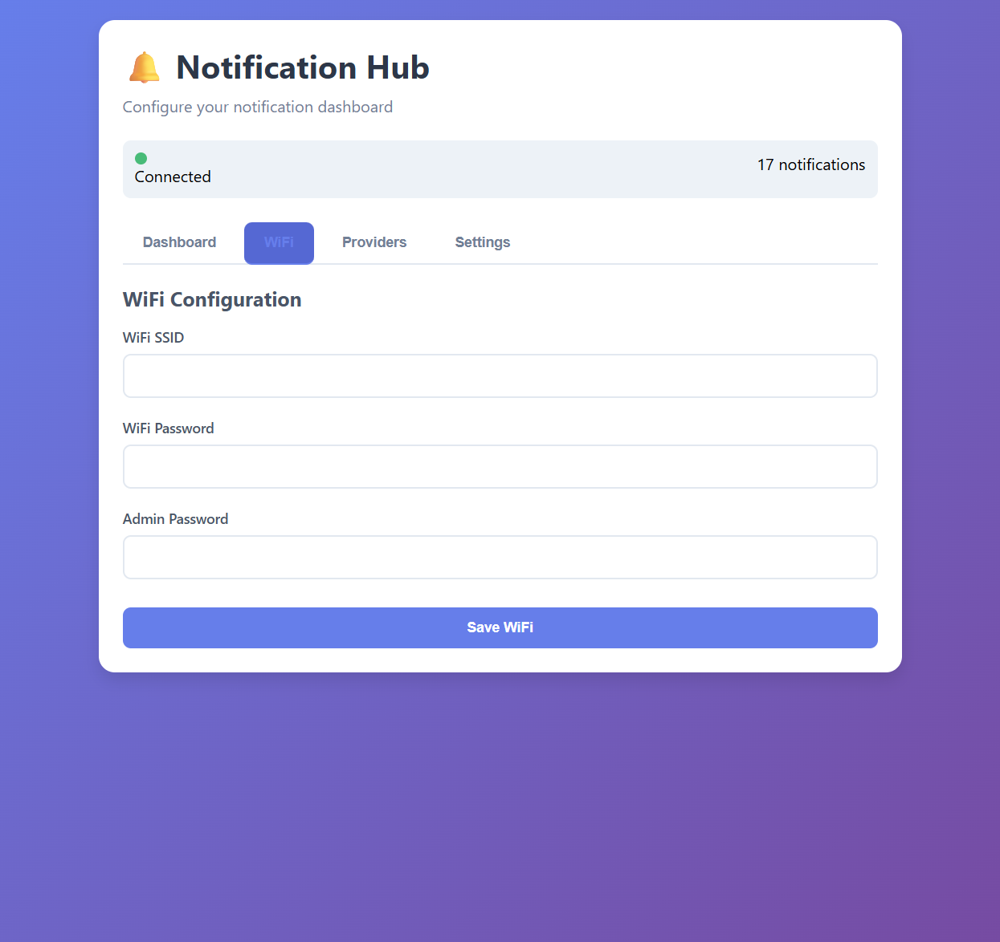
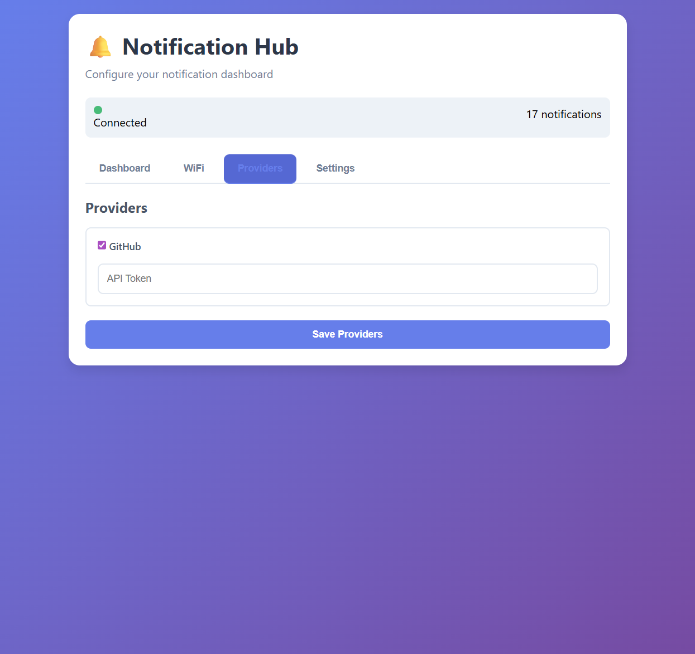
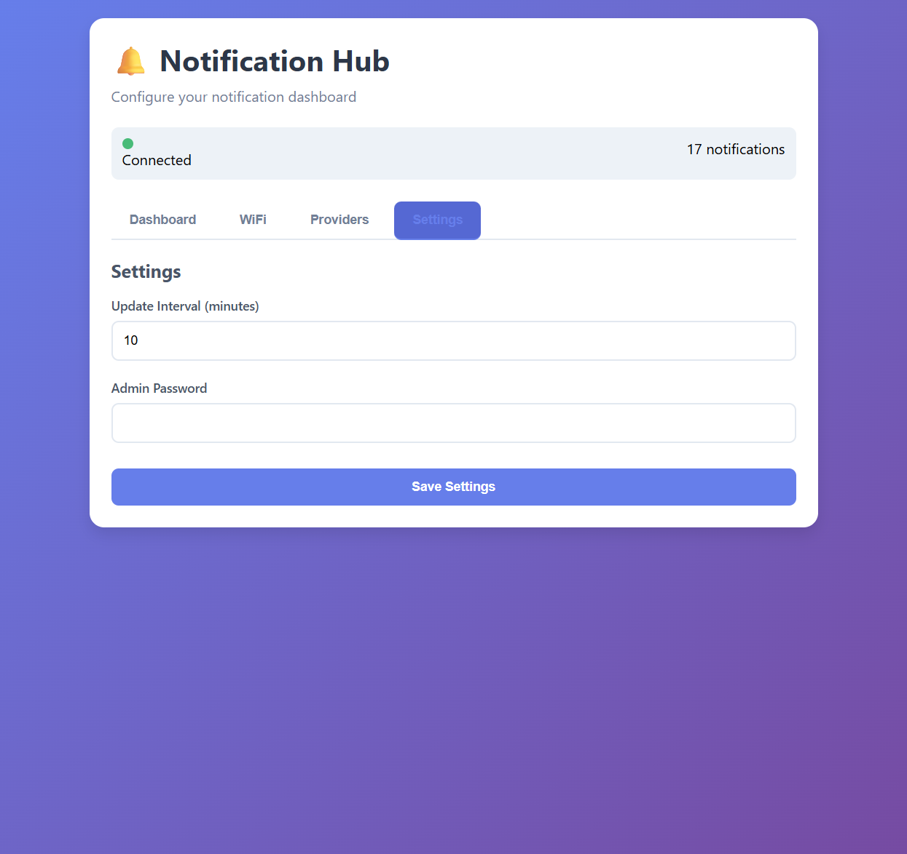

# GitHub Notification Dashboard - E-Paper Edition

A smart notification dashboard for GitHub notifications running on ESP32 with an e-paper display. This device fetches your GitHub notifications and displays them in a clean, categorized format on a 2.13" e-paper display.

## Features

- **Multi-Screen Dashboard**: Three screens accessible via button press:
  - **Notifications**: Real-time unread GitHub notifications with category breakdown
  - **Profile**: GitHub profile statistics (repos, stars, open PRs, followers)
  - **PR Overview**: Your open pull requests with merge status, CI checks, and review state - quickly identify PRs ready to merge
- **Smart Screen Cycling**: Button on GPIO 39 cycles through screens with 4-second debounce
- **Efficient API Usage**:
  - REST API for notifications
  - GraphQL API for profile and PR overview (minimized payload size)
- **Category Breakdown**: Organizes notifications by type:
  - Review Requests
  - Mentions
  - Assignments
  - Other notifications
- **E-Paper Display**: Low-power 2.13" black & white e-paper screen
- **Optimized Refresh**: Only updates display when data actually changes
- **Deep Sleep Support**: Energy-efficient operation with configurable wake intervals
- **Web Interface**: Configure WiFi, API tokens, and settings via browser
- **WiFi Auto-Connect**: Remembers your WiFi credentials
- **Persistent Storage**: All settings saved to flash memory

## Hardware Requirements

- **ESP32** development board
- **GxEPD2_213_BN** 2.13" e-paper display (250x122 pixels)
  - Tested with: [LilyGo T5 2.13" E-Paper](https://lilygo.cc/products/t5-2-13inch-e-paper)
- **Wiring**:
  - CS: GPIO 5
  - DC: GPIO 17
  - RST: GPIO 16
  - BUSY: GPIO 4
- **Optional Buttons**:
  - Refresh: GPIO 0
  - Wake: GPIO 39
- **Status LED**: GPIO 2

## Getting Started

### Initial Setup

1. Upload the firmware to your ESP32
2. The device will start in **Setup Mode** (creates WiFi AP)
3. Connect to WiFi network: `NotificationHub` (password: `configure`)
4. Open browser and navigate to: `http://192.168.4.1`

### Configuration

#### WiFi Setup

1. Go to the **WiFi** tab in the web interface
2. Enter your WiFi SSID and password
3. Set an admin password for security
4. Click **Save WiFi** (device will reboot)

#### GitHub Integration

1. Generate a GitHub Personal Access Token:
   - Go to GitHub Settings → Developer settings → Personal access tokens
   - Create a **Classic token** with the following scopes:
     - `notifications` - For fetching notifications
     - `read:user` - For profile and activity data
2. In the web interface, go to **Providers** tab
3. Enable GitHub provider
4. Enter your GitHub username
5. Paste your token
6. Enter admin password and click **Save Providers**

#### Settings

- **Update Interval**: How often to check for notifications (default: 10 minutes)
- Adjust in the **Settings** tab

## Usage

### Display Screens

The device has three screens that you can cycle through by pressing the button on GPIO 39:

#### 1. Notifications Screen



- GitHub logo
- Total notification count
- Category breakdown with icons:
  - 🔍 Reviews
  - @ Mentions
  - 👤 Assignments
  - ! Other
- Footer with WiFi SSID and connection status

#### 2. Profile Screen


- GitHub logo
- Profile title
- Statistics with icons:
  - 📦 Public Repos
  - ⭐ Total Stars (across all repos)
  - 🔀 Open Pull Requests
  - 👥 Followers
- Footer with WiFi SSID and connection status

#### 3. PR Overview Screen



- GitHub logo
- PR Overview title
- Your open pull requests with:
  - ✅ Mergeable status
  - 🔄 CI/Check status
  - 👀 Review state
  - 📝 PR title and number
- Helps quickly identify PRs ready to merge without opening GitHub
- Footer with WiFi SSID and connection status

### Screen Cycling

- Press the **button on GPIO 39** to cycle through screens:
  - Notifications → Profile → PR Overview → (back to) Notifications
- Button has **4-second debounce** to prevent accidental double-presses
- **Instant visual feedback**: Screen switches immediately, then fetches fresh data
- Each screen only updates its data when active (saves API calls)

### Manual Refresh

- Press the **Refresh button** (GPIO 0) to force update current screen
- Press the **Screen Cycle button** (GPIO 39) to switch screens (also refreshes data)
- Use the **Refresh Now** button in the web interface

### Web Interface

The device provides a full-featured web interface for configuration and monitoring:

#### Dashboard Tab



- Real-time connection status
- Current notification count
- Manual refresh button

#### WiFi Tab



- WiFi SSID and password configuration
- Admin password setup
- Network settings

#### Providers Tab



- Enable/disable GitHub provider
- GitHub API token configuration
- Provider management

#### Settings Tab



- Update interval configuration
- Admin password management
- System settings

### Web Interface Endpoints

- `GET /` - Main configuration page
- `GET /api/status` - Current status and notification counts
- `POST /api/config` - Save WiFi/settings
- `GET /api/providers` - List configured providers
- `POST /api/providers` - Update provider settings
- `POST /api/refresh` - Trigger manual refresh
- `POST /api/reset` - Factory reset (requires admin password)

## Power Management

### Deep Sleep Mode

When enabled (default), the device:

1. Wakes up every N minutes (configurable)
2. Connects to WiFi
3. Fetches data for current active screen (Notifications/Profile/PR Overview)
4. Updates display if data changed
5. Enters deep sleep

**Wake Sources**:

- Timer (based on update interval)
- Button press on GPIO 39 (cycles to next screen and updates)

**Web Server Timeout**: Device stays awake for 30 seconds after boot to allow web access, then sleeps

### Smart Display Updates

The device implements intelligent display refresh logic:

- Only updates display when data actually changes
- Tracks last displayed values for each screen
- Prevents unnecessary e-paper refreshes (reduces flicker and extends display life)
- Each screen maintains its own update state independently

### Disabling Sleep

Set `SLEEP_ENABLED false` in the code to disable deep sleep (useful for debugging)

## Configuration Constants

```cpp
UPDATE_INTERVAL_MS      = 9 * 60 * 1000  // Main loop interval (deprecated in favor of config)
GITHUB_MAX_PAGES        = 25              // Max pages to fetch from GitHub
GITHUB_PER_PAGE         = 13              // Notifications per page
JSON_BUFFER_SIZE        = 8192            // JSON parsing buffer
HTTP_TIMEOUT_MS         = 10000           // HTTP request timeout
WEB_SERVER_TIMEOUT      = 30000           // Stay awake time (ms)
```

## Default Credentials

**Initial Config** (stored in Preferences):

- WiFi SSID: _(empty - configure in setup mode)_
- WiFi Password: _(empty - configure in setup mode)_
- Admin Password: `admin`

**AP Mode** (when not configured):

- SSID: `NotificationHub`
- Password: `configure`

**⚠️ WARNING**: Change default admin password immediately in production!

## Serial Monitor Output

Connect at **115200 baud** to see detailed logs:

- System initialization
- WiFi connection status
- API requests and responses
- Notification parsing
- Display updates
- Power management events

## Troubleshooting

### WiFi Connection Issues

- Verify SSID and password in web interface
- Check signal strength (device may be too far from router)
- Monitor Serial output for connection errors

### GitHub API Issues

- **401 Error**: Invalid token - regenerate GitHub token
- **403 Error**: Rate limited - wait or check token permissions
- **Empty Response**: Network issue or API down

### Display Not Updating

- Check wiring connections (CS, DC, RST, BUSY)
- Verify `ENABLE_DISPLAY` is defined
- Look for display errors in Serial monitor

### Memory Issues

- Reduce `GITHUB_MAX_PAGES` if running out of heap
- Monitor "Free Heap" in Serial output
- Consider reducing `JSON_BUFFER_SIZE`

### Factory Reset

1. Go to web interface
2. Use `/api/reset` endpoint
3. Provide admin password
4. Device will clear all settings and reboot

## Dependencies

### Arduino Libraries

- **WiFi.h** - ESP32 WiFi support
- **WiFiClientSecure.h** - HTTPS/TLS connections
- **HTTPClient.h** - HTTP client for API requests
- **WebServer.h** - Configuration web interface
- **Preferences.h** - Non-volatile storage
- **ArduinoJson** - JSON parsing and serialization
- **GxEPD2_BW** - E-paper display driver
- **U8g2_for_Adafruit_GFX** - Advanced font rendering

All libraries can be installed via Arduino Library Manager.

## Development Tools

This project was built using:

- **[Arduino MCP Server](https://github.com/niradler/arduino-mcp)** - Model Context Protocol server for Arduino CLI interactions, enabling AI-assisted development with seamless board detection, sketch compilation, and serial monitoring.

## Contributing

Contributions are welcome! This project is open source and we appreciate:

- Bug reports and fixes
- Feature suggestions and implementations
- Documentation improvements
- Hardware compatibility reports

See `llm.md` for detailed development documentation.

## License

MIT License - Feel free to use, modify, and distribute this project.
